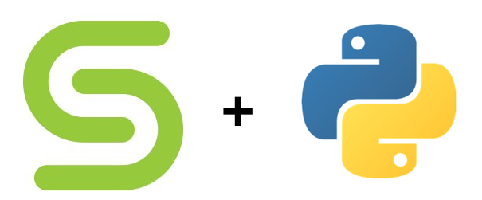

# Cohesity Python SDK



## Overview
The *Cohesity Python SDK*  provides an easy-to-use language binding to harness the power of *Cohesity REST APIs* in your python applications.

## Prerequisites
* Requires a `Cohesity Cluster` running version `6.0` or higher
* Python `2.7` or `3.4+`
* This SDK depends on other Python packages. These dependencies are defined in the `requirements.txt` file that's included with the SDK.
	* certifi >= 14.05.14
	* six == 1.8.0
	* python_dateutil >= 2.5.3
	* setuptools >= 21.0.0
	* urllib3 >= 1.15.1
	* prettytable >= 0.7.2

You can install these dependencies easily using `pip`.
Python and PIP executables should be defined in your PATH.
Open command prompt and type ```pip --version```.
This should display the version of the PIP Dependency Manager installed if your installation was successful and the paths are properly defined.

* Using the command line, navigate to the directory containing the files (including `requirements.txt`) for the SDK.
* Run the command `pip install -r requirements.txt`. This should install all the required dependencies.

## Getting started with Cohesity Python SDK
Follow these simple steps to start using `Cohesity Python SDK`.

#### Step 1: Download Cohesity Python SDK
Download the zip file from GitHub and extract it to a suitable location.
* https://github.com/cohesity/restapi-python/archive/master.zip

Once you have extracted the zip file you should see the directory structure as below:
```
.
├── samples
└── sdk
    ├── cohesity
    │   ├── apis
    │   └── models
    ├── docs
    └── test
```
* `sdk` directory contains a python package called `cohesity` which can be imported in your python scripts.
* `samples` directory contains some sample python scripts for reference that demonstrate the use of the SDK.

#### Step 2: Import required cohesity python modules
In your python scripts, you will need to import the `cohesity` python modules as below.

```python
import cohesity
from cohesity.rest import ApiException
from cohesity.configuration import Configuration
```
Note that the `sdk` directory needs to be added to the python module load path as below.
```python
sys.path.append('/path_to_extracted_zip_file/sdk')
```

Alternatively, you can also change the environment variable `PYTHONPATH` to specify additional directories to look for python modules.

#### Step 3: Perform the operation
The snippet below connects to a `Cohesity Cluster` and generates an access token.

```python
import sys
sys.path.append('/path_to_extracted_zip_file/sdk')

import cohesity
from cohesity.rest import ApiException
from cohesity.configuration import Configuration
from pprint import pprint

# Cohesity cluster that we want to connect to
host = "cohesity.example.com"

config = Configuration()
config.host = 'https://%s/irisservices/api/v1' % host
config.verify_ssl = False

# Create an API instance
api_instance = cohesity.AccessTokensApi()
body = cohesity.AccessTokenCredential(username="admin", password="admin")

try:
    # Generate an Access Token.
    api_response = api_instance.generate_access_token(body)
    pprint(api_response)
except ApiException as e:
    print "Failed to generate access token: %s\n" % e
```

## What can Cohesity Python SDK do for you?
This SDK exposes all the functionality provided by `Cohesity REST API`.

You can perform a wide range of operations such as,
* Retrieve `Cohesity Cluster` details
* List protection sources
* List the protection jobs
* Resolve alerts
* And much more...

Check out the scripts included under `samples` for reference.

## Questions or feedback
We would love to hear from you. Please send your questions and feedback to: *cohesity-api-sdks@cohesity.com*
