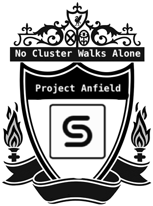

# Project Anfield (Cohesity Cluster Export/Import)

This Project helps take Cohesity Cluster's configuration export and import it in other clusters so that the metadata or the configuration is created with 1-click.This Project draws inspiration from formidable fortress of the best football team in the world: Liverpool Football Club. 

<p align="center">
  
</p>

## Overview

Current version fo the tooling supports export and import the cluster resources namely:
  * Cohesity Views
  * Storage Domains 
  * External targets(NAS, s3) 
  * Cluster Configs
    * DNS
    * NTP Servers
    * Domain Names
  * Protection Jobs
  * Protection Sources
    * VMWare 
    * Physical
    * NAS
    * Cohesity Views
    * Isilon(NFS)
    * MsSql
  * Protection Policies
  * Replicated Clusters
  * Gflags
  
## Installation
```
pip install cohesity_management_sdk configparser 
```
This will work for Python 3 >=3.4.

## Prerequisite
```
1. The API connectivity from the box which is running these scripts to the exported/imported cluster(s).
2. In config.ini :
            a. Exported Cluster credentials.
            b. Imported Cluster credentials.
            c. Replicated cluster credentials. 
            d. Protection sources such as vCenter credentials.
            3. S3 Secret Access key. 
```
## Note

1. This is not a restore point feature. It doesn't add/delete incremental updates for existing entities.

2. Override - Flag to override the existing protection resources during import-config is available in config.ini. 
   
   `override=True/False`

    Protection Sources

    When override option is enabled, while importing sources existing sources are refreshed. Whereas when override is disabled, no changes is made to the existing sources.

     Protection Jobs
     
     When override option is enabled, full backup of jobs is performed. 
     
    For example, 
    1. At time t0, cluster ClusterA has a protection job 'Job' with 3 vms(VM1, VM2, VM3) and resources are exported.
    2. When we import the exported config(from ClusterA) to a new cluster 'ClusterB', clusterB will have protection job 'Job' with same 3 vms(VM1, VM2, VM3). 
    3. At time t1, In ClusterA, we are adding new vm(VM4) to protection job 'Job'(so total objects protected by Job is 4) and export the resources.
    4. When to try to import the updated config in ClusterB with following options,
    ```
    Override=False
      Override is disabled, so Job in clusterB will not be updated. It will contain only 3 jobs(VM1, VM2, VM3).

    Override=True
      Override is enabled, so Job in clusterB will be updated. It will contain 4 jobs(VM1, VM2, VM3, VM4).
    ```

    Protection Policies, Protection Views, Storage Domains
    
    When override is enabled, existing policies views and storage domains are updated.

    Remote Clusters
    
    When override is enabled, while importing existing remote clusters storage domain mapping and other settings are updated. Whereas if overrride is disabled no changes are made to existing remote clusters.
    
3. Gflag - Flag to import gflags for services from exported cluster.

   `gflag=True/False`

   After importing the gflags into the target cluster, each individual services which needs the gflag change needs to be restarted manually.
   NOTE: This feature imports all the gflags to the cluster. To apply gflag for specific service, chose only the individual service and restart. Gflags import/export is supported with cluster version >= 6.3.

4. While importing Isilon sources, only NFS protocols are supported. If a job contains both NFS and SMB objects, only NFS objects are added to job.

## Export 

Run the following command to export resources.
```
python export_cluster_config.py
```
The above command will generate a <export-config-ClusterName-timestamp> file (eg: export-config-Kursk-2020-04-17-12:15) which needs be provided while importing resources.

### Ouput 
```
INFO:export_app:Exporting resources from cluster 'Kursk'
INFO:export_app:
 *** Exported resources summary ***

INFO:export_app:	*** Protection Views ***:
Check, NaveenaView, Test, DemoUI, Target

INFO:export_app:	*** Storage Domains ***:
DefaultStorageDomain, StorageRe;l, Physical

INFO:export_app:	*** Protection Policies ***:
Default Policy, Bronze, Gold, viewpolicy, Nas policy, Replication policy, Silver, Physical

INFO:export_app:	*** Protection Jobs ***:
newmanJob-1584050541627-412, VMWare-job, Replication Job , DB_tier

INFO:export_app:	*** External Targets ***:
Newman-vault-1586863576896, Newman-vault-1586870313194, TestTarget, check, CheckTarget

INFO:export_app:	*** Protection Sources ***:
 10.2.x.y:/target, x.y.z.y, 10.2.145.23, 10.2..x.y, vcenter.eng.cohesity.com
```

 ## Import
```
python import_cluster_config.py <export-config-Cluster-Name-timestamp>
```

### Output
```
INFO:import_app:
 *** Imported resources summary ***

INFO:import_app:Successfully registered/created the following Protection Views:
Check, NaveenaView, Test, DemoUI, Target

INFO:import_app:Successfully registered/created the following External Targets:
TestTarget, check, CheckTarget

INFO:import_app:Successfully registered/created the following Protection Sources:
10.2.x.y:/target, 10.2.x.y, 10.2.x.y

INFO:import_app:Successfully registered/created the following Protection Policies:
Default Policy, Bronze, Gold, viewpolicy, Nas policy, Replication policy, Silver, Physical

INFO:import_app:Successfully registered/created the following Protection Jobs:
SingleVm

*** Corrective actions/errors  ***
ERROR:import_app: Please specify the password for vCenter vcenter.eng.cohesity.com source in config.ini
ERROR:import_app:Response status code: 500, Response message: Specified parent source vcenter.eng.cohesity.com does not match the real parent source 10.2.x.y of entity App-tier-vms-0
```
